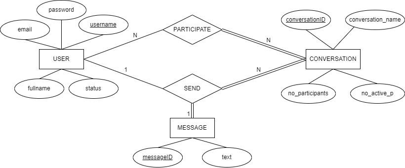

## ChatApp C++ Project
#This is internship project developed by DASH team.
Member:
- Tran Duy Khanh
- Le Moc Tram
- Tran Huy Nam Hung
- Dang Thanh Trung
- Le Vo Phu Thinh


## Introduce

ChatApp is a simple chat application project written in C++ language. This application uses the TCP protocol to connect between the server and the clients, allowing multiple clients to connect and chat with each other via the server.


## Feature

 
- Connect multiple clients simultaneously to the server.

- Send and receive messages directly between clients.

- Displays a list of users currently connected to the server.


## Libaries used


The ChatApp project is built using the C++ programming language and uses the following technologies and libraries:

 
- **TCP protocol**: Uses the TCP/IP protocol to build a connection between the server and the clients. TCP protocol ensures reliable and reliable data transmission between servers and clients.

- **Library `<iostream>`**: The C++ standard library is used to input and output data from and to streams. In this project, it is used to interact with users, enter names and messages.

- **Library `<cstring>`**: The C++ standard library provides functions for working with string literals. In this project, it is used to manipulate username and message strings.

- **Library `<regex>`**: The C++ standard library provides support for Regular Expression (regex). In this project, it is used to check the validity of username and password.
 
- **Library `<pthread>`**: The POSIX Threads (pthread) library is used to support thread creation and management in the project. Threads are used to handle multithreaded connections and concurrency between servers and clients.
 
- **Library `<mysql/mysql.h>`**:

- **Library `<arpa/inet.h>`**:

- **Library `<./unistd.h>`**:

- **Library `<openssl/sha.h>`**:

- **Library `<iomanip>`**:
- **Library `<conio.h>`**:


## Database


- From this ERD, we can intuitively understand the data flow in the CHAT APPLICATION.
- Database description: 
  + USER is used to store the 'User' information. 
  + CONVERSATION is used to store the metadata of every conversation, even if it is a private chat or a group chat.
  + MESSAGE is used to store the message text.
  + PARTICIPATE is used to store the information of which conversations the user are in
  + SEND is used to store the metadata of each message (Who send the message? What is the ID of the message they send? Which conversation do the message send to?)


## Docker

- Docker and docker-compose are used. For more imformation [Docker](https://docs.docker.com/get-docker/)
- Containerize applications into server and database images.
- To install docker and docker-compose use
```
sudo apt-get install -y docker
sudo apt-get install -y docker-compose
```

- To grant permission of docker command without sudo use
```
sudo usermod -a -G docker $USER
```

- **Note:** For docker application, you should in your **cba** directory 

- To build images use
```
./docker-build.sh
```

- To run chat app with docker compose use
```
docker-compose up
```

- To stop docker compose use
```
docker-compose down
```

## System Requirements
 

- Operating system: Windows, Linux, macOS.

- Compiler supports C++11 and above. For more imformation [C++ standard](https://isocpp.org/std/the-standard)

 

## How to install and run

 

1. Copy the source code from the repository:

git clone http://192.168.122.20/dash/cba.git

(or download the source code from the GitHub page and extract it)

2. Move to the source code directory:

cd cba

3. Server and Client Compilation:

Server:
```
cd server 

g++ -o server server.cpp -lmysqlclient
```
Client:
```
cd ../client

g++ -pthread -o client client.cpp -lcrypto 
```

4. Run server:
```
cd ../server
./server
```
5.Run client
```
cd ../client
./client
```
 

 

## Use

 

- When running the server, it listens for connections from clients on the specified port (default is 12345), ip (ip address of the server)

- When the client connects, ask the user to enter option:

  1. login 

  2. create account

  3. quit

- When the authentication is complete, the client will be forwarded to the chat, 

- To send a masage  the user enters <message>

- To exit the application, the user enters "exit".

 

## Custom

 

- You can modify settings like default gateway, maximum number of connections, etc. by editing the source code in the server.cpp and client.cpp files.

## Author

 

- Author Name: [DASH_CBA](http://192.168.122.20/dash)

- Contact: youremail@example.com

 

## Contribute

 

If you want to contribute to this project, please send a pull request and contact us.

 
## License


[MIT License](https://mit-license.org/)
